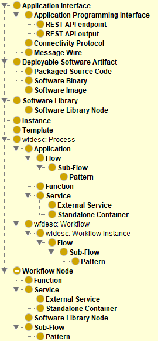
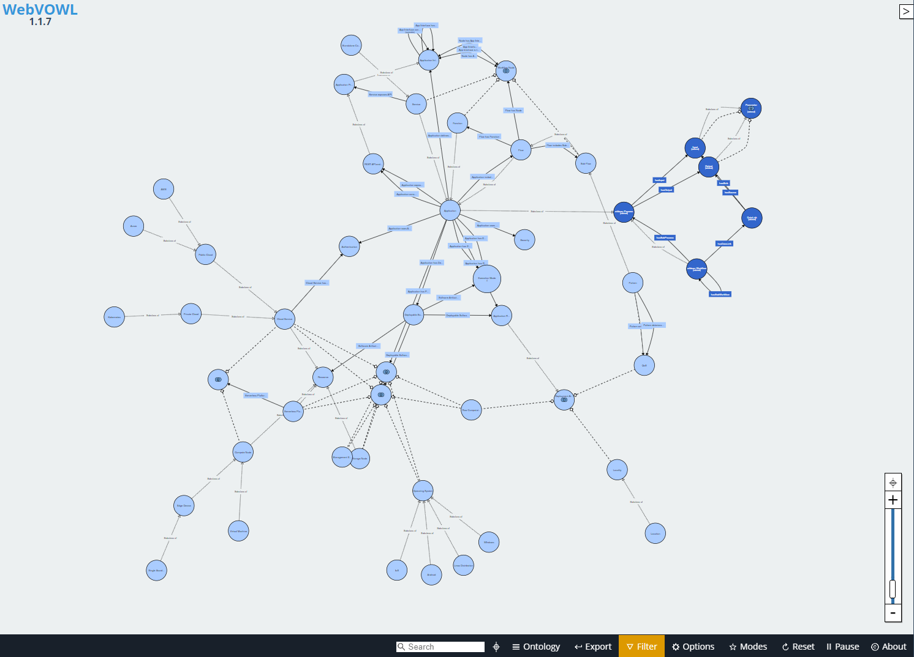

# H2020-PHYSICS Application Ontology

The H2020-PHYSICS Application Metamodel/Ontology.

Links:

- [**Visual** walkthrough via **WebVOWL**!!!][webvowl-showcase]
- [View the ontology **file**][main-file]

## Domain of Ontology

The ontology, although stored as a single file, can be regarded as a set of well-connected terms that can be split into two: The Core application ontology and the Extensions.

The core application ontology revolves around the concepts that have to do with (a) the data model of the function workflows, (b) workflows as parts of an application or as a combination of applications, and (c) the interfaces between the parts of the workflow, commonly referred to as nodes. As such, the core ontology mainly revolves around the hierarchy of the different classes of application components, based on core ideas related to the “Workflow” term, and applying them to the node-red flow model. The idea is to express all terms in a hierarchy that enables the inheritance of properties, as well as the ability to reason over application definitions. Additionally, the core ontology includes the “Pattern” term, while different design patterns, such as those explored in section 3.3 are laid out as its subclasses.

The high-level modelling of the application description begins with the “Process” term, in the highly abstract domain of workflow descriptions, rather than the more specialized term in the domain of operating systems. The “Application” and “Workflow” terms are the direct children of the high-level “Process” class. The “Workflow” class is also abstract, and the specialization used in PHYSICS is the “Flow” class, which encompasses flows as they exist in visual workflow designers, and are deployable in the PHYSICS platform. The “Sub-Flow” class signifies the packaging of flows as reusable sub-flows in other flows, as well as the mandatory message wire inputs and/or outputs they have to include. The “Application” class encompasses any piece of logic that is deployable to the continuum, regardless of its size and characteristics. An “Application” individual is either a member/instance of the subclasses of “Application”, or a composition of more individuals like this. The domains and ranges, which are the classes/types of the objects and values, of the properties related to “Application” are important, as they signify the ways in which simple or complex applications are composed, and by extension imply the possible or desired placements and deployment strategies. As such, the PHYSICS “Flow” class is a descendant of both the abstract “Workflow” and the PHYSICS “Application” class, since one flow can by itself be an application. On a similar note, and because of the use of the FaaS model, the “Function” class, which encompasses function nodes, is a subclass of “Application”. Functions can be used in Flow compositions, and are considered to be the most basic atomic deployable entities. There are also Applications that do not fall in the “Flow” or “Function” classes, which are packaged as services, and are also used in Flow compositions. The “Service” class encompasses these applications, and serves as a connection between FaaS and other paradigms. The “External Service” is a direct subclass of “Service”, which encompasses Services that are used in PHYSICS Applications, but are not controlled by the same entities, and may not even be part of the PHYSICS ecosystem. The deployment of an application may be handled differently, based on the external services it uses, as their operation is not under the control of the platform, and the application may need to be optimized so that parts of it have more performant and reliable access to those services. The “Standalone Container” is another subclass of “Service”, which signifies the reuse or deployment of a complete containerized service as part of an application. A “Standalone Container” individual is controlled by the same entity that deploys the application, and the PHYSICS platform, enabling the deployment and reuse of applications that do not fall into the FaaS domain and are possibly monolithic or legacy or resource-heavy processes.
A flow is composed of different nodes, and are all encompassed in the PHYSICS “Workflow Node” class. This class is a disjoint union of multiple classes, mainly “Function”, “Software Library Node”, “Service”, and “Sub-Flow”, because each Workflow Node can be a member of only one of these classes. Ready-made nodes that can be used in the visual composition tool which utilize, at least a part of, a library are members of the “Software Library Node” class. Moreover, the members of the “Pattern” class are essentially pre-loaded subflows, created based on a software or cloud design pattern, and imported into the visual environment. As such, Patterns are inferred to be part of the “Workflow Node” disjoint union. A Pattern, however, is to be handled differently from a mere Sub-Flow, in reasoning, optimization and deployment processes, as each pattern has its own characteristics, requirements and use-cases, with many pre-set properties, and additional configuration properties specific to each Pattern type.

Similarly, the interfaces between applications, and/or their components, are encompassed in the “Application Interface” class. Application Interfaces exist in Applications or Flows in various different forms. The topmost subclasses are “API”, “Connectivity Protocol”, and “Message Wire”, each with different properties and class hierarchies. Message Wires are essentially the connections between simple nodes in Flows, and can be interpreted in many different ways by the PHYSICS platform, depending on the situation. APIs and Connectivity Protocols are found anywhere, and signify the way with which the applications and components interact and communicate, either in the same execution environment, or over the network, or over even the internet.

*Note that the above picture only includes the basic terms, and not the entirety of the ontology terms.*

This overall class structure is the core of the PHYSICS Application ontology, and is meant to be able to describe the overall characteristics and structure of an application. It is also the skeleton upon which different properties are based, in order to be able to create descriptions that can be processed by the combination of OWL reasoning, custom rules reasoning, and further AI-based decision-making and optimization processes of the PHYSICS platform, so as to make optimal placements and deployments on the continuum.

The current version of **the complete PHYSICS ontology can be viewed and explored, as a visual graph, via web browser, [through here][webvowl-showcase]**! Following is a preview of the ontology, as viewed through WebVOWL:

The extensions of the ontology provide connections between the Core Ontology Classes and other related domains, in order to enable the matching of an Application with the Resources it can or will be deployed on, through reasoning and optimization processes.

## External Ontologies included

- The **[Abstract Workflow Description (Wfdesc)][wfdesc] ontology: Imported in its entirety**.
- The [Informatics Research Artifacts Ontology (irao)][irao]: Imported the **'Benchmark'** definition.
- May or may not be introduced in the future: [Wfprov ontology][wfprov].

[webvowl-showcase]: https://service.tib.eu/webvowl/#iri=https://drive.google.com/u/0/uc?id=1-9dnKP3Qr0oa9dEarp-hH2QfYvbXuDN4&export=download
[irao]: http://ontology.ethereal.cz/irao
[wfdesc]: http://purl.org/wf4ever/wfdesc
[wfprov]: http://purl.org/wf4ever/wfprov
[main-file]: PHYSICS_ONTOLOGY.ttl
